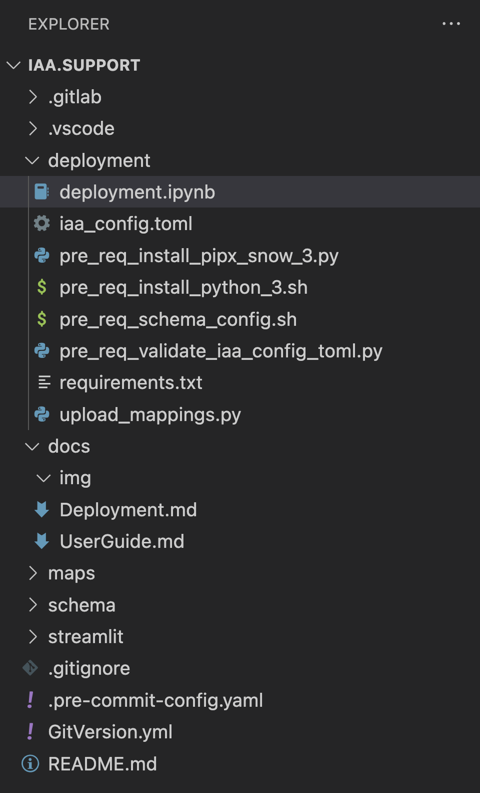
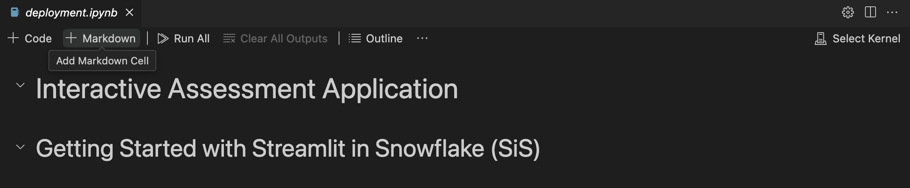
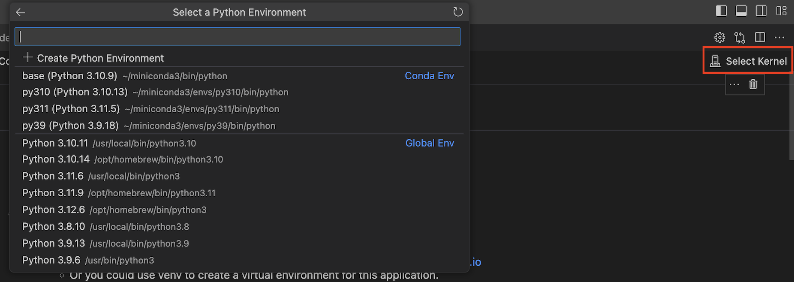

 

## Deployment

### Project Structure 

- ***Deployment***: Setup files for deployment the app to Snowflake in Streamlit (SiS)
- ***Maps***: Mappings files, data related with the different APIs compatibility of Snowpark Migrator Accelerator.
- ***Schema***: Data Base Schema file, required DDL for the Streamlit app.
- ***Streamlit***: Streamlit files. Python code of the application.

### Pre-requisites

#### 1. Sign up for a Snowflake Free Trial (Optional):
If you don't have a Snowflake account, you can jump over to the [Snowflake Free Trial signup](https://signup.snowflake.com/?utm_cta=sit-iaa-signup?) page, enter the details required, and tap continue. Follow the steps required and check your email for an Activation link. Keep the credentials handy as you will need them to connect.

#### 2. Python 3.11 or later:
There are several ways to accomplish this requirement, some operative systems already have Python installed.
If that one is not the case for your machine please find below some alternatives:
- If your OS is Linux or Mac you can run the script [deployment/pre_req_install_python_3.sh](../deployment/pre_req_install_python_3.sh).
- For Windows, if you don't have Python you can get it from the [official Python website](https://www.python.org/downloads/).
- Another alternative is to install with Miniconda [docs.conda.io](https://docs.conda.io/projects/miniconda/en/latest/) 

### Running the notebook

For running the notebook you can do it from [VSCode](https://code.visualstudio.com/) or [Jupyter](https://jupyter.org/) in this case we are going to use VSCode.

1. Download or clone this repository to your local machine. 
2. Open VSCode and open the folder which contains the repository files.

3. Open the notebook [deployment/deployment.ipynb](../deployment/deployment.ipynb)

4. Select your prefer "Kernel" the Python version has to be equal or gretter than 3.11 to run the notebook. 

5. Update your Snowflake account configuration. In the file [deployment/iaa_config.toml](../deployment/iaa_config.toml)

6. Execute all the notebook cells. By clicking `Run All`.

7. Click on the Button `Open IAA`

