# IAA User Guide

After [installation of the IAA](Deployment.md) in your Snowflake Account. It's time to analyze your workload.

You'll find the landing page of IAA.

<div style="text-align: left; margin:15px 60px 15px 60px;">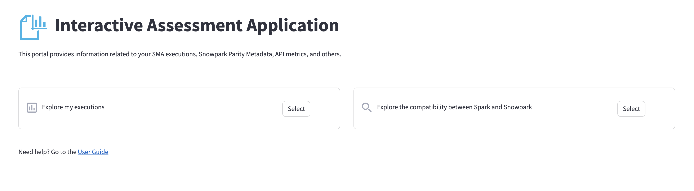</div>


## Explore my executions

### How to upload your SMA output
You can get the SMA in the following [link](https://www.snowflake.com/en/data-cloud/snowpark/migration-accelerator/). if you need more information on how to run the SMA, find the details in their [documentation](https://docs.snowconvert.com/sma).

1. Run Assessment in your code.
  <div style="text-align: left; margin:15px 60px 15px 60px;">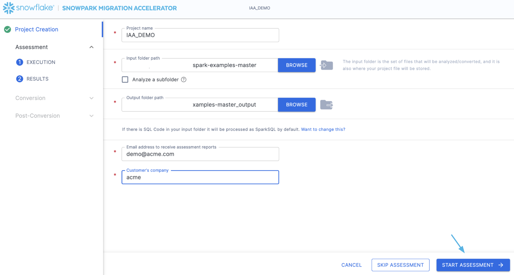</div> 

2. Click on View Results
  <div style="text-align: left; margin:15px 60px 15px 60px;">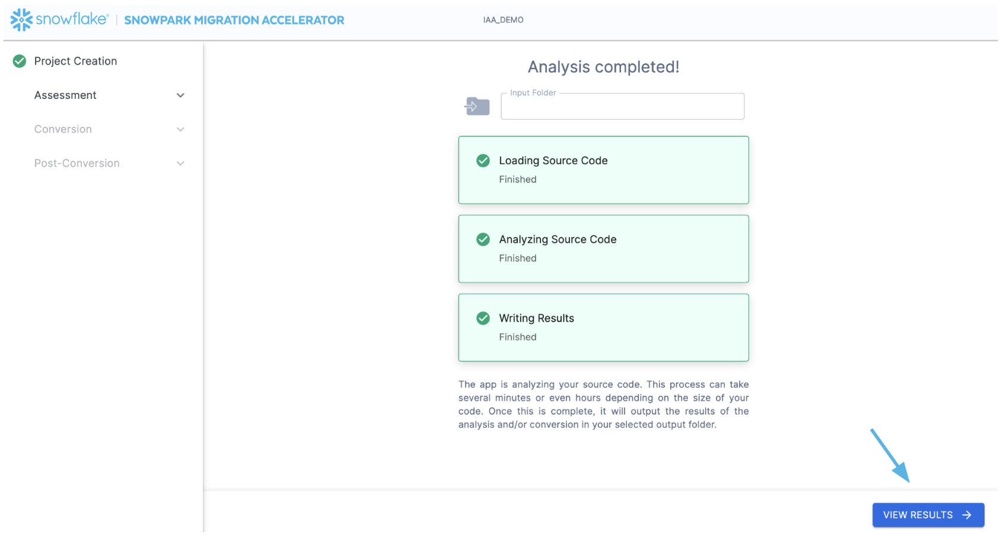</div>

3. Navigate to the output folder to get the Zip File **AssessmentFiles_*.zip**

4. Go to your Snowflake account, the one for the deployment, and navigate to the **SMA_EXECUTIONS** stage. By clicking 
  
  ```
  Data > Databases > [Name of the Database of deployment] > Stages > SMA_EXECUTIONS
  ```
<div style="text-align: left; margin:15px 60px 15px 60px;">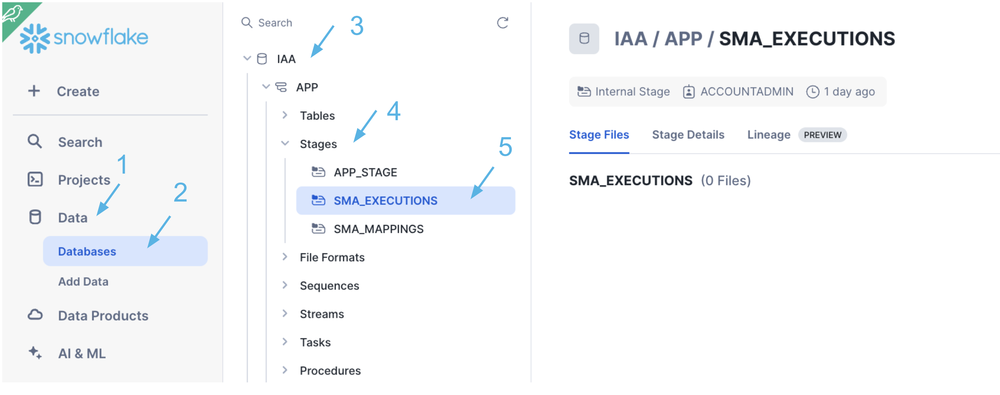</div>

5. Upload your **AssessmentFiles*.zip** into the stage.

<div style="text-align: left; margin:15px 60px 15px 60px;">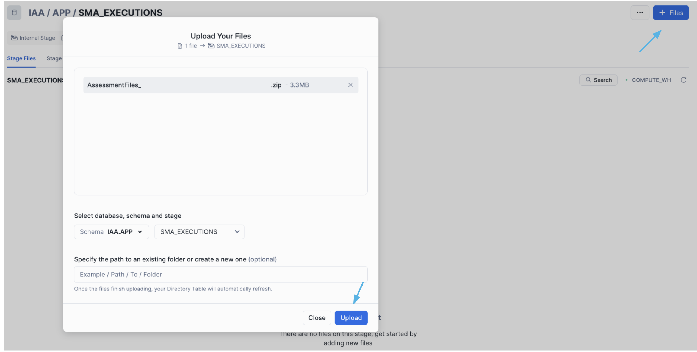</div>

6. Navigate to your **Interactive Assessment Application**
   
 <div style="text-align: left; margin:15px 60px 15px 60px;">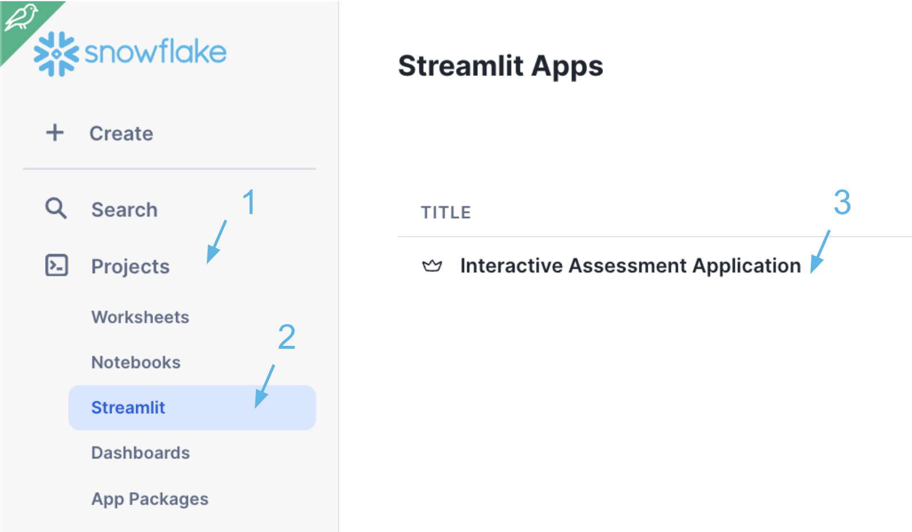</div>

7. Click Reload **Interactive Assessment Application**
   
 <div style="text-align: left; margin:15px 60px 15px 60px;"></div>

8. This data will take about 30 seconds to load, you can reload the page.
   
 <div style="text-align: left; margin:15px 60px 15px 60px;">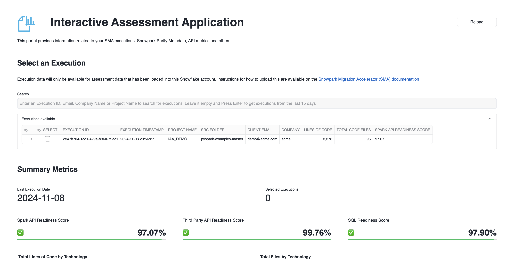</div>

### Explore your execution

In left side menu you will find the different aspect of the execution to explore.

- **Execution**: This is a brief summary of the selected executions. with a few key metrics like Spark API, Third party API, and SQL readiness score. Here you can select a single or multiple executions.
<div style="text-align: left; margin:15px 60px 15px 60px;">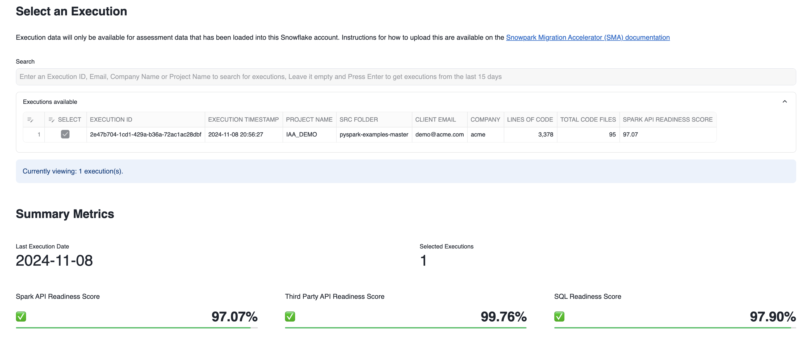</div>

- **Inventories**: This section provides exportable raw files (xlsx format) about topics from notebooks to IO file operations.
<div style="text-align: left; margin:15px 60px 15px 60px;">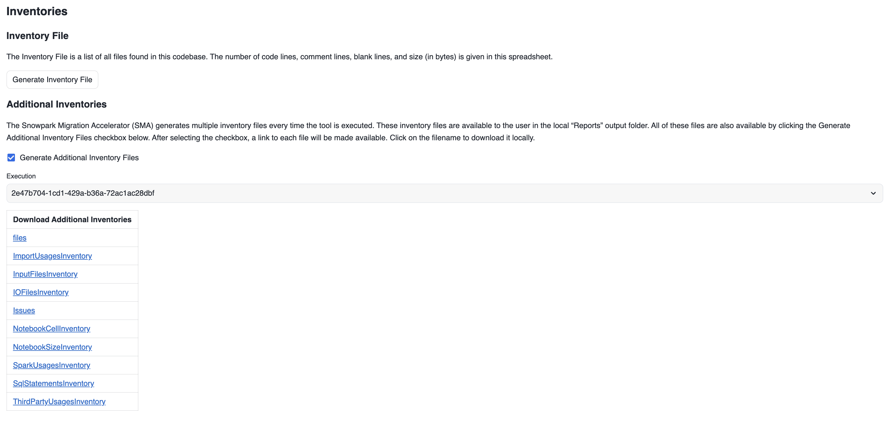</div>

- **Assessment Report**: Download the SMA report.

-  **Code Tree Map**: It shows the distribution of files in a graphical tree map. The size of the squares represent the size of the code files.
<div style="text-align: left; margin:15px 60px 15px 60px;">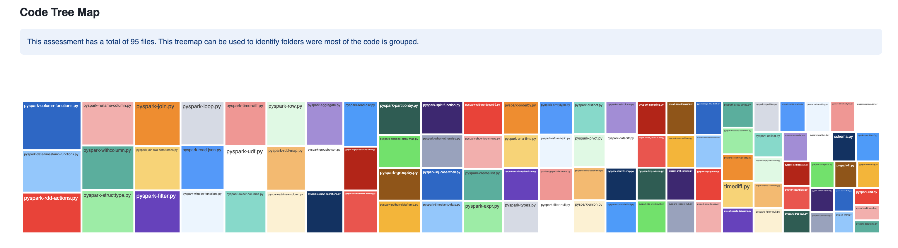</div>

- **Readiness by File**: It shows the breadown by file and the readiness for migration.
<div style="text-align: left; margin:15px 60px 15px 60px;">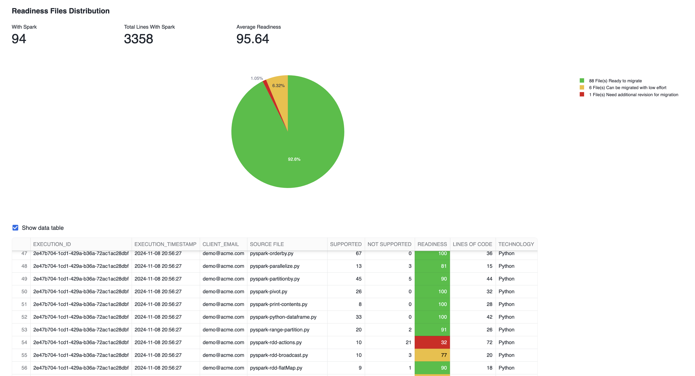</div>

- **Reader Writers**: Allow you to understand which files in your project are reading or writing. 

- **Dependencies**: This section provides information related with your project depedencies, it includes internal dependencies and external one.
<div style="text-align: left; margin:15px 60px 15px 60px;">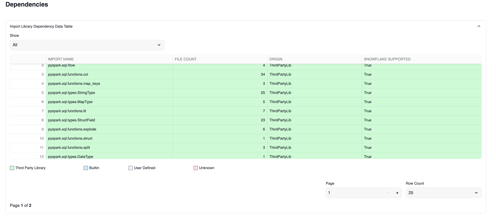</div>
  
## Explore the compatibility between Spark and Snowpark

This section of the App provides insights of the current capabilities of SMA for different kind of APIs. This is not specific to your execution.

<div style="text-align: left; margin:15px 60px 15px 60px;">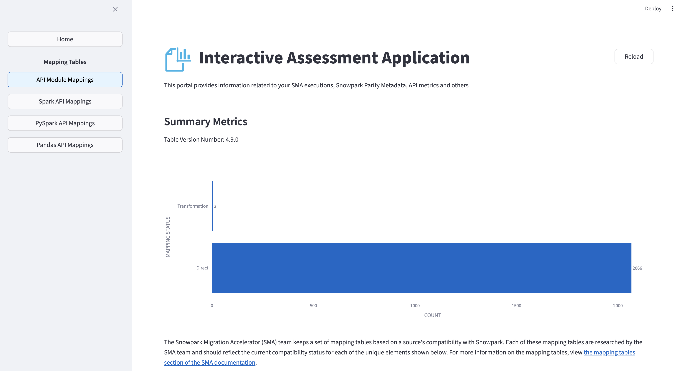</div>

### Api Module Mappings 
This will give you information of the current support for libraries including programming language Built-ins or third parties.
  In the category dropdown you can filter by the kind of library.
  <div style="text-align: left; margin:15px 60px 15px 60px;">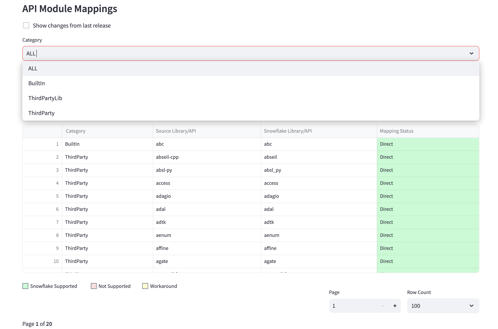</div>

### Spark, PySpark and Pandas API Mappings
The Spark libraries refers specifically those for Scala/Java, and their equivalent in Snowpark.
In the case of Pyspark Libraries they are exclusive for Python.

<div style="text-align: left; margin:15px 60px 15px 60px;">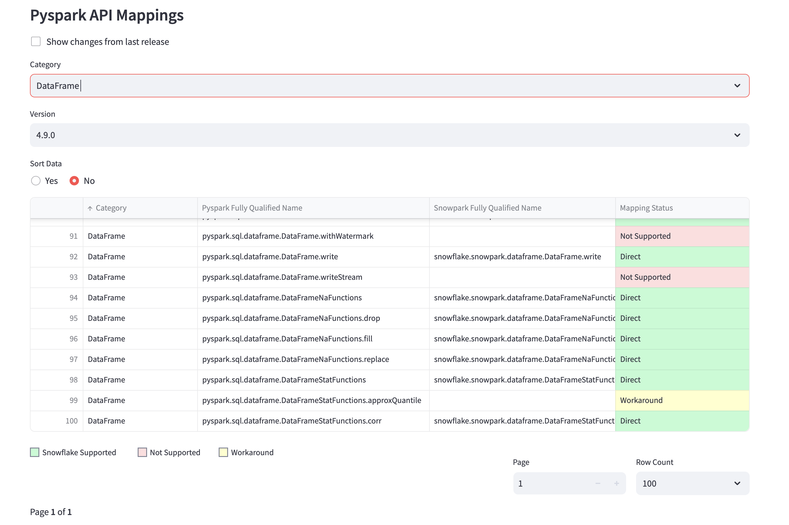</div>

#### How to read this information
In the image below we see 4 different columns.
- **Category**: Is the name the different groups  
- **Spark/PySpark Fully Qualified Name**: This is the full name of function, class, method for the Spark API.
- **Snowpark Fully Qualified Name**: This would be the equivalent function, class or method for Snowpark.
- **Mapping Status**: This shows how the SMA will treat each of the Spark/Pandas for more details on meaning of the status please check [SMA documentation](https://docs.snowconvert.com/sma/user-guide/assessment/spark-reference-categories).


